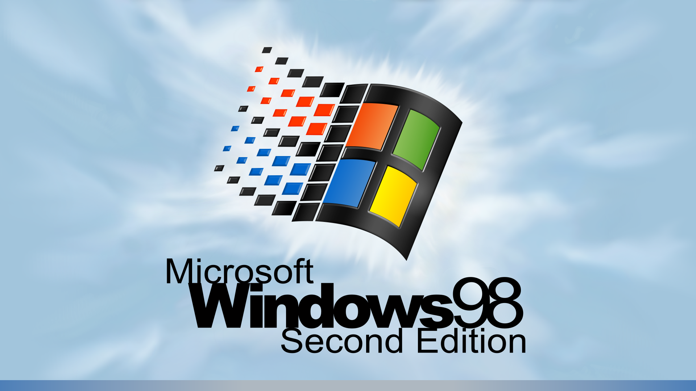

# SE98 1920x1080 Plymouth theme

## Disclaimer

I just edited the [Windoze95 1080 Plymouth theme](https://github.com/Liftu/Windoze95-1080-Plymouth-theme) of [Liftu](https://github.com/Liftu) who just edited a work of [LASZCZ](https://www.pling.com/u/Laszcz) -- [Windoze95](https://www.pling.com/p/1202357/).

Edits from Liftu version :
- Change background image.
- Extra slowed down the progress bar cycle.

*TODO*
The theme is very raw (undone). The **logoff** animation is not ready! It's still in **win95** style with **4x3** format.
## Installation

Requirements:

- Inkscape
- ImageMagic

How to install from sources:

- Read the `INSTALL` file.
- Execute make script by running `./make` or `awk -f make` (autodetect resoluton)
- Or `./make 1024x768` or `./make 1920x1080 1280x1024 800x600`
- Copy newly created `se98` sub-directory to `/usr/share/plymouth/themes/` directory.
- Enable it by running `sudo plymouth-set-default-theme -R se98`
- You can run `./test-plymouth` to display the current bootsplash theme.

## Screenshot

